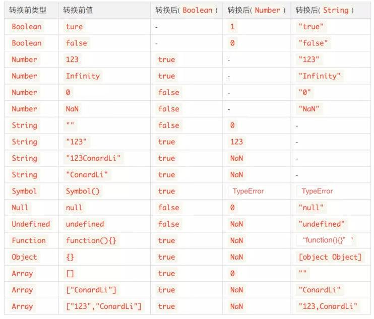

# 类型
javascript包括两大类型：基本类型、引用类型
基本类型：`Undefined`、`Null`、`Boolean`、`Number`、`String`、`Symbol`
引用类型：`Object`
### 基本类型与引用类型的区别
1. 不可变性
基本类型：在ECMAScript标准中，他们被定义为`primitive values`，即原始值，代表值本身是不可被改变的。存储在栈中，在变量定义时，栈就为其分配好了内存空间。由于栈中的内存空间的大小是固定的，那么注定了存储在栈中的变量就是不可变的
引用类型：存储在堆中，它在栈中只保存了一个固定长度的地址，这个地址指向堆内存中的值
2. 复制
基本类型：会在栈中开辟一个新的内存空间来存储复制出来的值
引用类型：实际上复制的是栈中存储的地址，因此复制出来的变量和之前的变量指向堆中同一个对象
3. 比较
基本类型：直接比较它们的值是否相同
引用类型：比较它们的引用地址是否相同
### 笔记
1. `Undefined`表示未定义的值，它是全局对象上的一个属性，并非一个关键字

2. `Null`在内存中表示栈中的变量没有指向堆中的内存对象，当一个对象被赋值了 null 以后，原来的对象在内存中就处于游离状态，GC 会择机回收该对象并释放内存

3. `typeof null=='object'`返回true
这是因为数据类型在底层都是以二进制形式表示的，二进制的前三位为0会被typeof判定为对象类型：
000 - 对象
1 - 整型
010 - 双精度类型
100 - 字符串
110 - 布尔类型
null值的二进制全是0，所以会被误认为是对象类型

4. `null==undefined`为true
5. `Boolean`类型转换
所有对象都被当作true
空字符串被当作false
null和undefined被当作false
数字0和NaN被当作false
除了以上三条外的值类型都被当作true
6. 操作符比较规则
关系操作符：`>`、`>=`、`<`、`<=`
+ 当两个操作数都是数值，则进行数值比较
+ 当两个操作数都是字符串，则逐个比较两者对应的字符编码(charCode)，知道分出大小为止
+ 如果操作数是其他基本类型，则调用Number()将其转化为数值，然后进行比较
+ NaN与任何值比较都返回false
+ 如果操作数是对象，则调用对象的valueOf方法（如果没有valueOf方法，就调用toString方法），最后用得到的结果，根据前面的规则执行比较
相等操作符号：`==`、`!=`
+ 如果有一个操作数是布尔值，则在比较相等性之前，先调用Number()将其转换为数值
+ 如果一个操作数是字符串，另一个操作数是数值，则在比较相等性之前，先调用Number()将字符串转换为数值再进行比较
+ 如果一个操作数是对象，另一个操作数不是，则调用对象的valueOf()方法，用得到的基本类型值按照前面的规则进行比较
+ 如果有一个操作数是NaN，则相等操作符返回false，而不相等操作符返回true
+ 如果两个操作数都是对象，则比较它们的指针地址。如果都指向同一个对象，则相等操作符返回true；否则，返回false
+ null和undefined是相等的
相等操作符号：`===`、`!==`
+ `===`：类型相同，并且值相等，才返回true，否则返回false
+ `!==`：类型不同，或者值不同，就返回true，否则返回false
逻辑操作符号：`&&`、`||`
+ `&&`：从左到右检测每一个分项，返回第一个布尔值为 false 的分项，并停止检测 。如果没有检测到 false 项，则返回最后一个分项
+ `||`：从左到右检测每一个分项，返回第一个布尔值为 true 的分项，并停止检测 。如果没有检测到 true 项，则返回最后一个分项
7. UTF-8表示字符是可变的，有可能是用一个字节表示一个字符，也可能是两个、三个，UTF-16是表示任何字符都用两个字节来保存。如果是全中文的使用UTF-16，如果是混合型就用UTF-8
8. Number类型采用`64`位存储的`双精度浮点数`（符号位：1位，指数位：11位，小数位：52位）来表示一个数字，不区分整数和浮点数，例如1.0000和1是相同的。一个数大于等于2<sup>1024</sup>会发生正向溢出，会返回Infinity，一个数小于等于2<sup>-1075</sup>会发生负向溢出，会返回0
9. 0.1+0.2不等于0.3
由于计算机内部使用二进制存储数据，一些浮点数在转换为二进制时会出现无限循环，这时为了表示该数会在最末尾进行0舍1出，最终导致了精度丢失，正确的比较方法：`Math.abs(0.1 + 0.2 - 0.3) <= Number.EPSILON`
10. Number类型的特殊数值
`Number.MAX_VALUE`：JavaScript 中的最大值
`Number.MIN_VALUE`：JavaScript 中的最小值
`Number.MAX_SAFE_INTEGER`：最大安全整数，为 253-1
`Number.MIN_SAFE_INTEGER`：最小安全整数，为 -(253-1)
（在安全整数范围内不会出现精度丢失（小数除外））
`Number.POSITIVE_INFINITY`：对应 Infinity，代表正无穷
`Number.NEGATIVE_INFINITY`：对应 -Infinity，代表负无穷
`Number.EPSILON`：是一个极小的值，用于检测计算结果是否在误差范围内
`Number.NaN`：表示非数字，NaN 与任何值都不相等，包括 NaN 本身
`Infinity`：表示无穷大，分 正无穷 Infinity 和 负无穷 -Infinity
11. 类型转换表：

12. 类型运用数学运算符：
除了`+`之外的数学运算符`(- * / %)`会先将非Number类型转换为Number类型
`+`：
+ 当一侧为 String 类型，被识别为字符串拼接，并且会优先将另外一侧转换为字符串类型
+ 当一侧为 Number 类型，另外一侧为原始类型，则将原始类型转换为 Number 类型
+ 当一侧为 Number 类型，另一侧为引用类型，将引用类型和 Number 类型转换成字符串后拼接
13. `typeof function(){}`返回`"function"`
14. `toString()`是Object的原型方法，调用该方法，默认返回当前对象的`[[CLass]]`，这是一个内部属性
```javascript
Object.prototype.toString.call(null) ; // [object Null]
Object.prototype.toString.call(new Function()) ; // [object Function]
Object.prototype.toString.call(new Date()) ; // [object Date]
Object.prototype.toString.call([]) ; // [object Array]
```
15. `isNaN`函数会强制将参数转换为数值类型，再进行判断